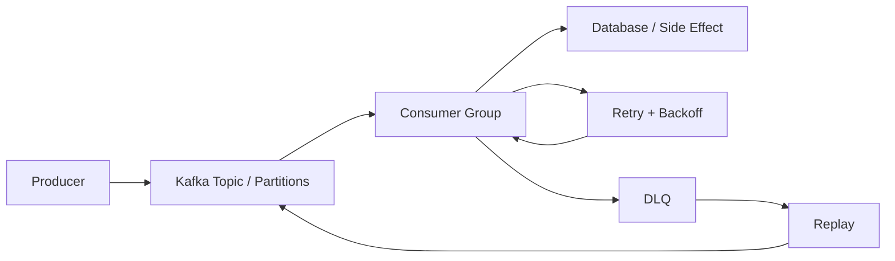

# Kafka Event Platform

> **Building resilient, observable event-driven systems**

A production-shaped Kafka lab covering **event contracts, partitioning, consumer groups, idempotency, retries/DLQ, replay and observable failure handling**.


## Architecture



## Engineering questions

- What is the event contract?
- How is partitioning chosen?
- Where is ordering guaranteed?
- How do consumers remain idempotent?
- What happens when processing fails halfway through?
- When should an event be retried versus sent to a DLQ?
- How can failed events be replayed safely?
- What should be observable at producer, broker and consumer boundaries?
- How does schema evolution avoid breaking consumers?

## Failure matrix

| Failure | Expected behaviour |
|---|---|
| Duplicate event | Idempotent consumer |
| Transient consumer failure | Retry with backoff |
| Poison message | DLQ |
| Consumer restart | Resume safely |
| Delayed event | Explicit ordering policy |
| Schema change | Compatibility strategy |
| Operational recovery | Controlled replay |

## Build standard

```text
event contract
    ↓
working producer
    ↓
Kafka topic
    ↓
consumer
    ↓
persistent side effect
    ↓
failure injection
    ↓
metrics + logs
    ↓
retry / DLQ / replay
```

**Status:** implementation in progress. The README describes the target engineering behaviour; implementation details will be added as each experiment becomes runnable.
